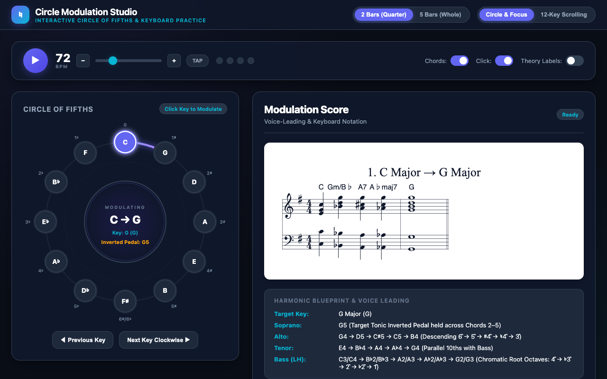

# Circle Modulation Studio 🎵

[](https://benjaminpritchard.github.io/circle_modulation_1/)

An interactive, responsive Circle of Fifths practice trainer and musical score visualizer for mastering modulations through all 12 major keys.

> 🌐 **Play it live**: [https://benjaminpritchard.github.io/circle_modulation_1/](https://benjaminpritchard.github.io/circle_modulation_1/)

---

## Screenshot

<!-- Screenshot Placeholder: Will be captured once deployed -->


---

## About & AI Generation

This application was generated by **Google Gemini** using the **Gemini 2.5 Flash** model via Google AI Studio.

It is a 100% client-side web application built with vanilla web technologies:
- **Sheet Music Notation**: Rendered in vector SVG using **ABCJS** (via CDN).
- **Audio & Metronome**: High-precision metronome lookahead scheduler and polyphonic chord synthesizer using the **Web Audio API** (zero external audio files or soundfonts needed).
- **Visualization**: Interactive SVG Circle of Fifths diagram with animated connection arcs.

---

## ✨ Key Features

1. **Interactive SVG Circle of Fifths Diagram:**
   - Tap or click any of the 12 keys around the circle ($C \to G \to D \to A \to \dots \to F \to C$).
   - Real-time animated luminous arc connecting the source key to the target modulation.
   - Dynamic center hub displaying the current transition, key signature, and inverted pedal pitch.

2. **Compact 2-Measure Format (Quarter Notes):**
   - Measure 1 contains the 4 chromatic voice-leading chords as quarter notes.
   - Measure 2 resolves into the target tonic chord as a whole note.
   - Includes a toggle for the 5-Measure Whole-Note Chorale format.

3. **12-Key Overview Mode (Dimmed Inactive Styling):**
   - See all 12 modulations notated simultaneously.
   - Currently selected modulation is fully illuminated with an indigo glow, while other modulations are elegantly muted.
   - Clicking any card instantly focuses and illuminates that key.

4. **High-Precision Metronome & Play-Along Auto-Advance:**
   - Web Audio API lookahead scheduler for rock-solid timing.
   - Distinct woodblock clicks (1200 Hz downbeat, 800 Hz beats 2–4).
   - Polyphonic synthesizer backing chords with smooth ADSR envelope.
   - Automatically advances clockwise around the circle every 2 measures (8 beats) for keyboard practice.
   - Tap tempo, tempo slider, stepper buttons, and animated visual beat dots.

5. **Theoretical Blueprint & Voice Leading Card:**
   - Detailed breakdown of each voice for pianists and theory students:
     - **Soprano:** Common inverted pedal held at the top.
     - **Alto:** Chromatically descending line ($6̂ \to 5̂ \to ♯4̂ \to ♮4̂ \to 3̂$).
     - **Tenor:** Parallel 10ths with the bass line ($1̂ \to ♭7̂ \to 6̂ \to ♭6̂ \to 5̂$).
     - **Bass (LH):** Chromatic descending root octaves ($4̂ \to ♭3̂ \to 2̂ \to ♭2̂ \to 1̂$).
   - Toggleable Roman numeral and figured bass analysis.

---

## ⌨️ Keyboard Shortcuts

| Shortcut | Action |
| :--- | :--- |
| `Space` | Start / Stop Metronome & Auto-Advance |
| `→` (Right Arrow) | Next Key Clockwise |
| `←` (Left Arrow) | Previous Key Counter-Clockwise |
| `M` | Mute / Unmute Metronome Click |
| `C` | Mute / Unmute Synthesizer Chords |

---

## 🔗 Deep-Linking URL Parameters

- `?view=grid` — Open directly in the 12-Key Overview grid
- `?key=3` — Jump directly to key index (0 = C, 1 = G, 2 = D, 3 = A, etc.)
- `?format=whole` — Load the 5-measure whole note chorale format
- `?roman=1` — Show Roman numerals and figured bass

---

## 🚀 Running Locally

Because this application is pure static HTML/JS/CSS, you can run it with any local HTTP server:

```bash
# Using Python 3:
python3 -m http.server 8088
# Or using the included server.py:
python3 server.py 8088
```

Then open your browser to **http://localhost:8088/index.html**.

---

## 🌐 Deploying to GitHub Pages

Deploy the static files directly to the `gh-pages` branch on GitHub:

```bash
git push origin main:gh-pages --force
```
